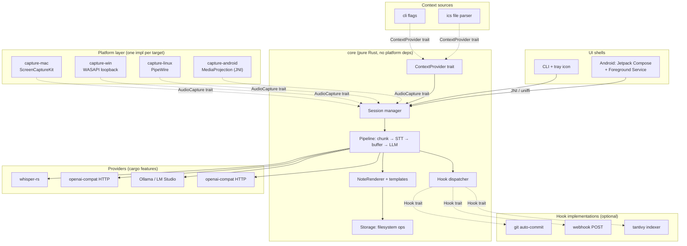
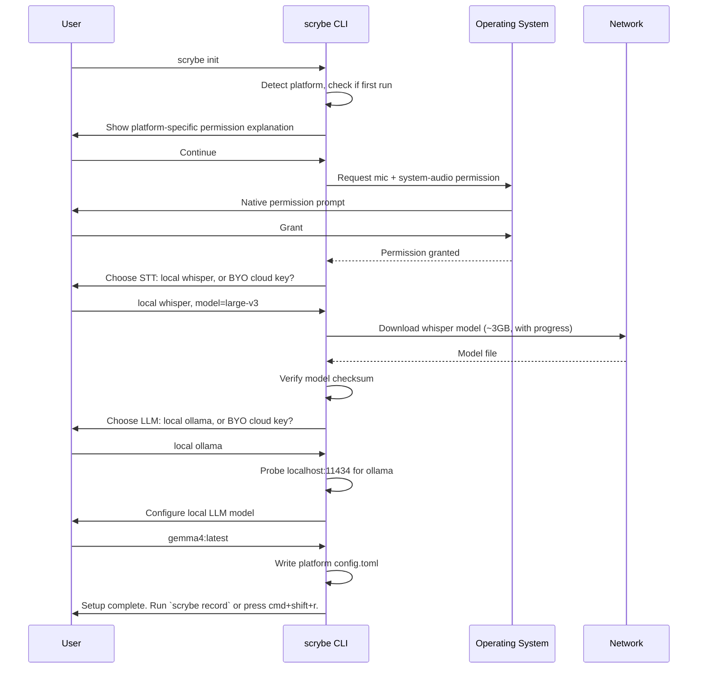
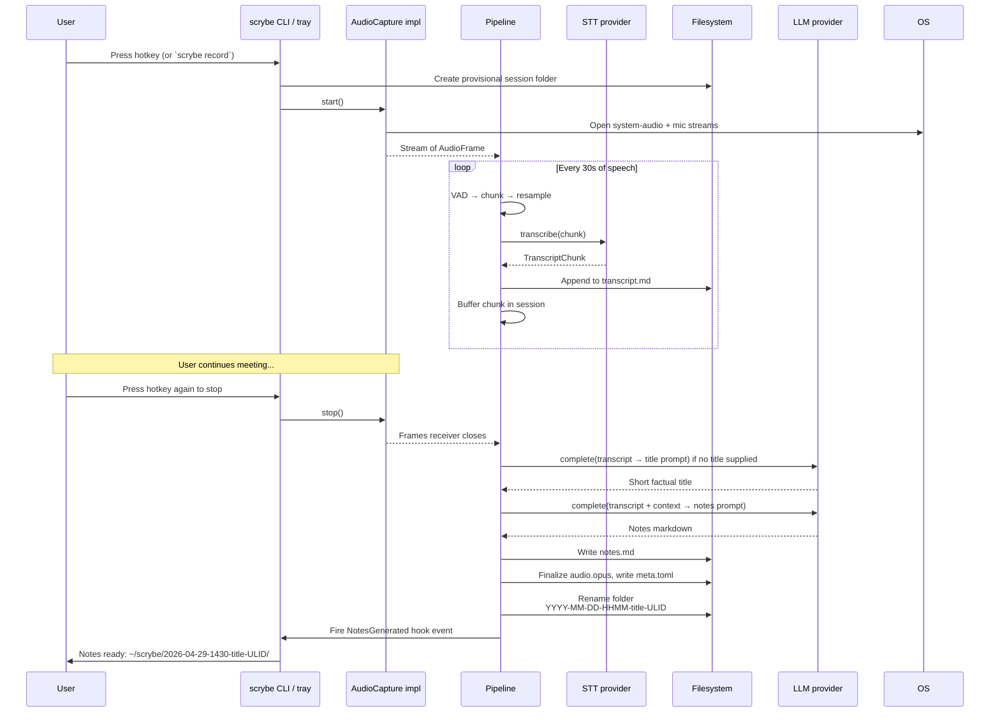
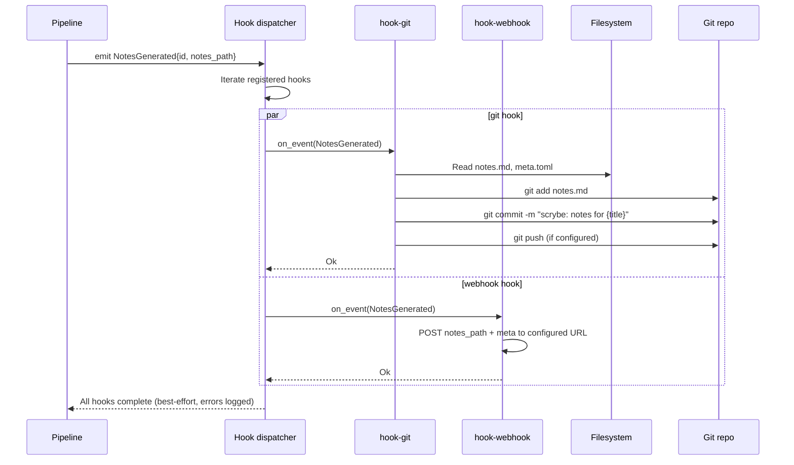
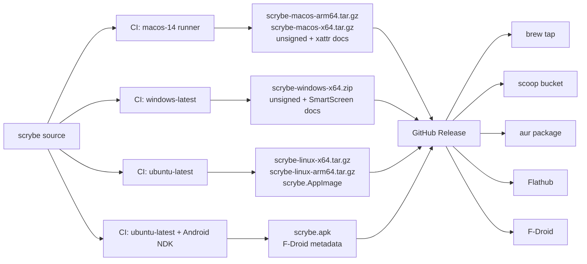

# scrybe — System Design

> Detailed architecture, component design, data flow, and workflows.
> Companion document to `system-overview.md`.

---

## 1. Design goals and non-goals

### Goals

| Goal | Measurable form |
|---|---|
| One Rust core, four target platforms | Single `core` crate with no `cfg(target_os)` outside the capture adapters |
| Filesystem as the single source of truth | A user can delete the application, keep their `~/scrybe/` folder, and lose nothing |
| Zero outbound network by default | `cargo build --no-default-features --features <platform>,whisper-local` produces an air-gappable binary |
| Replaceable everything | Each of the four extension seams has at least two real implementations within v1.x |
| Compile times measured in seconds, not minutes | Cold release build of `cli` under 60s on M1 Pro |
| Onboarding to first transcript under 5 minutes | Including model download |
| ~15–20k LoC of Rust at v1.0 | Excluding generated code, vendored deps, platform shims, and tests. Leanness is measured as **`scrybe-core` ≤ 4k LoC** and **core/(sum of capture adapters) ratio ≤ 0.6** — not total |
| Pre-recording consent UX is mandatory | A `Consent` step runs before capture starts on every session, configurable but not removable. See `LEGAL.md` |

### Non-goals

| Non-goal | Why |
|---|---|
| Streaming transcription | 90% of value at 10% of complexity is batch chunking |
| Channel split as a substitute for real diarization | Channel separation gives binary `Me`/`Them` for 1:1 remote calls only. Multi-party and in-room meetings need the `Diarizer` trait (§4.5); v0.1 emits binary attribution, v0.5 adds neural fallback |
| Plugin runtime / dynamic loading | Compiled-in Rust hooks cover real use cases without ABI surface |
| Account system, sync server, web app | Open-core ladder; once on it, can't get off |
| iOS | Apple's sandbox forbids the necessary system audio capture |
| Calendar OAuth, Slack/Teams integrations | A `MeetingContext` from an `.ics` file is 80% of the value at 5% of the cost |
| Sub-100ms latency anywhere | Not a low-latency product |

## 2. High-level architecture



The contract that crosses platform boundaries is small: four traits and one struct. Everything else is implementation detail.

## 3. Workspace layout

```
scrybe/
├── Cargo.toml              # [workspace]
├── core/                   # ~2.5k LoC, zero platform deps
│   ├── src/
│   │   ├── lib.rs
│   │   ├── session.rs      # Session struct, lifecycle
│   │   ├── pipeline.rs     # VAD → STT → buffer → LLM
│   │   ├── capture.rs      # AudioCapture trait + AudioFrame
│   │   ├── context.rs      # ContextProvider trait + MeetingContext
│   │   ├── providers/
│   │   │   ├── stt.rs      # SttProvider trait
│   │   │   ├── llm.rs      # LlmProvider trait
│   │   │   ├── whisper_local.rs
│   │   │   └── openai_compat.rs
│   │   ├── notes.rs        # NoteRenderer + default templates
│   │   ├── hooks.rs        # LifecycleEvent + Hook trait + dispatcher
│   │   ├── storage.rs      # filesystem ops; not a trait yet
│   │   ├── config.rs       # TOML config loader
│   │   └── error.rs
│   └── tests/
├── capture-mac/            # cfg(target_os="macos")
│   ├── src/lib.rs          # uses screencapturekit-rs
│   └── shim/               # small Swift bits if needed
├── capture-win/            # cfg(target_os="windows")
│   └── src/lib.rs          # windows crate + cpal
├── capture-linux/          # cfg(target_os="linux")
│   └── src/lib.rs          # pipewire-rs
├── capture-android/        # cdylib, JNI/uniffi
│   └── src/lib.rs
├── context-cli/            # implements ContextProvider from CLI flags
├── context-ics/            # implements ContextProvider from .ics file
├── hook-git/               # optional cargo feature
├── hook-webhook/           # optional cargo feature
├── cli/                    # main desktop binary; hotkey + tray + record
└── android/                # Android Studio project
    ├── app/                # Kotlin Compose UI
    └── jniLibs/            # built from capture-android + core
```

## 4. The four extension seams in detail

### 4.1 `AudioCapture` — the platform contract

```rust
pub trait AudioCapture: Send + 'static {
    /// Begin capture. Permission prompts (macOS Core Audio Taps tap-creation
    /// or Screen Recording, Android MediaProjection) happen here.
    fn start(&mut self) -> Result<(), CaptureError>;

    /// Stop capture. Idempotent.
    fn stop(&mut self) -> Result<(), CaptureError>;

    /// Stream of frames. The stream yields `Err` for transient or terminal
    /// capture errors and closes when `stop()` is called.
    fn frames(&self) -> impl Stream<Item = Result<AudioFrame, CaptureError>> + Send + 'static;

    /// Static metadata about what this implementation can do.
    fn capabilities(&self) -> Capabilities;
}

pub struct AudioFrame {
    pub samples: Arc<[f32]>,       // interleaved; cheaply cloneable for fan-out
    pub channels: u16,             // 1 (mic-only) or 2 (mic L, system R)
    pub sample_rate: u32,          // raw rate; resampled to 16kHz before STT
    pub timestamp_ns: u64,
    pub source: FrameSource,
}

pub enum FrameSource { Mic, System, Mixed }

pub struct Capabilities {
    pub supports_system_audio: bool,
    pub supports_per_app_capture: bool,   // Win 10 2004+ only
    pub native_sample_rates: Vec<u32>,
    pub permission_model: PermissionModel,
}
```

This is the **only** trait that is allowed to vary by `cfg(target_os)`. The shape is **Tier 1** stability — frozen at v1.0; changes break every adapter at once. The `Stream`-returning shape replaces the original `mpsc::Receiver` draft (`.docs/development-plan.md` §2.2 H8): it expresses errors in-band without a side-channel and composes with `tokio_stream` adapters used by the pipeline. `Arc<[f32]>` replaces the original `Vec<f32>` draft (§2.2 M8): frames fan out to the channel splitter, the encoder, and the VAD/chunker without per-clone allocation.

### 4.2 `ContextProvider` — pre-call context

```rust
#[async_trait]
pub trait ContextProvider: Send + Sync {
    async fn context_for(
        &self,
        started_at: DateTime<Utc>,
    ) -> Result<MeetingContext>;
}

#[derive(Default, Debug, Serialize, Deserialize)]
pub struct MeetingContext {
    pub title: Option<String>,
    pub attendees: Vec<String>,
    pub agenda: Option<String>,
    pub prior_notes: Vec<PathBuf>,
    pub language: Option<Language>,
    pub extra: BTreeMap<String, String>,
}
```

Calendar integration lives entirely behind this trait. v1 implementations: `CliFlagProvider`, `IcsFileProvider`. Future: `GoogleCalendarProvider`, `OutlookProvider`, `EventKitProvider` (macOS native). None of those require touching the core.

### 4.3 `SttProvider` and `LlmProvider`

```rust
#[async_trait]
pub trait SttProvider: Send + Sync {
    async fn transcribe(&self, chunk: AudioChunk) -> Result<TranscriptChunk>;
    fn name(&self) -> &str;
}

#[async_trait]
pub trait LlmProvider: Send + Sync {
    async fn complete(&self, prompt: &str) -> Result<String>;
    fn name(&self) -> &str;
}
```

Two implementations per trait at v1: local (`whisper-rs` / Ollama) and `openai-compat`. Every cloud STT and LLM that matters speaks OpenAI-compatible HTTP; the URL + model + key in config is the entire selection mechanism. Anthropic users route via OpenRouter.

### 4.4 `Diarizer` — speaker attribution strategy

```rust
#[async_trait]
pub trait Diarizer: Send + Sync {
    /// Attribute each transcript segment to a speaker label.
    /// Input: per-channel transcript chunks with timestamps.
    /// Output: same chunks, each with a `speaker` field populated.
    async fn diarize(
        &self,
        mic_chunks: &[TranscriptChunk],
        sys_chunks: &[TranscriptChunk],
        ctx: &MeetingContext,
    ) -> Result<Vec<AttributedChunk>>;

    fn name(&self) -> &str;

    /// True for in-room / multi-party / single-channel inputs that
    /// the channel-split heuristic cannot resolve.
    fn requires_neural(capabilities: &Capabilities) -> bool;
}

pub struct AttributedChunk {
    pub chunk: TranscriptChunk,
    pub speaker: SpeakerLabel,    // Me | Them | Named(String) | Unknown
}
```

Two implementations:

- **`BinaryChannelDiarizer`** (v0.1, default) — uses energy-on-mic-only → `Me`, energy-on-system-only → `Them`, energy-on-both → both. Correct for 1:1 remote calls. Documents binary attribution as the v0.1 contract; users with multi-party calls see `Them: ...` for every non-self speaker.
- **`PyannoteOnnxDiarizer`** (v0.5, behind `--features diarize-pyannote`) — wraps `pyannote-onnx` 3.1+. Activated by config (`diarizer = "pyannote"`) or auto-activated when `Capabilities::supports_system_audio = false` (Android pre-API-29 fallback) or when `MeetingContext.attendees.len() >= 3`. Can map cluster labels onto names from `MeetingContext.attendees` via prompt-time post-processing.

`Diarizer` is **Tier 2** stability — the trait shape may evolve through v0.5 as we learn what the neural fallback needs. Frozen at v1.0.

### 4.5 `Hook` — lifecycle subscribers

```rust
pub enum LifecycleEvent {
    SessionStart   { id: SessionId, ctx: Arc<MeetingContext> },
    ConsentRecorded { id: SessionId, attestation: ConsentAttestation },
    ChunkTranscribed { id: SessionId, chunk: AttributedChunk },
    SessionEnd     { id: SessionId, transcript_path: PathBuf },
    NotesGenerated { id: SessionId, notes_path: PathBuf },
    SessionFailed  { id: SessionId, error: Arc<dyn Error> },
    HookFailed     { id: SessionId, hook_name: String, error: Arc<dyn Error> },
}

#[async_trait]
pub trait Hook: Send + Sync {
    async fn on_event(&self, event: &LifecycleEvent) -> Result<(), HookError>;
    fn name(&self) -> &str;
}
```

Hooks are **statically registered in `main.rs`** behind cargo features. No dynamic loading, no `.so`/`.dll`, no Wasm runtime. Adding a new hook is "write a struct, register it, recompile."

The dispatcher runs hooks concurrently via `futures::future::join_all`; one slow hook does not block another. Failures emit `LifecycleEvent::HookFailed` so they reach the CLI completion line and `meta.toml`. **No silent failures.**

### 4.6 Error type hierarchy

scrybe's error model is split along trait boundaries so each adapter crate owns its own variant set without depending on its siblings, and the orchestration layer composes them via `From` conversions. `thiserror` 1.x is used in every library crate (`scrybe-core`, `scrybe-capture-*`, future provider crates); `anyhow` 1.x is used only in `scrybe-cli` for context-chained user-facing reporting.

The concrete error types are **Tier 2** stability. `LifecycleEvent::SessionFailed` and `LifecycleEvent::HookFailed` carry `Arc<dyn std::error::Error + Send + Sync + 'static>`, which is **Tier 1**. Splitting or renaming a variant inside `CaptureError` is a minor-version change; widening the dyn-object signature is a major-version change.

```rust
// scrybe-core/src/error.rs

#[derive(thiserror::Error, Debug)]
pub enum CoreError {
    #[error("capture: {0}")]
    Capture(#[from] CaptureError),

    #[error("speech-to-text: {0}")]
    Stt(#[from] SttError),

    #[error("language model: {0}")]
    Llm(#[from] LlmError),

    #[error("storage: {0}")]
    Storage(#[from] StorageError),

    #[error("config: {0}")]
    Config(#[from] ConfigError),

    #[error("consent: {0}")]
    Consent(#[from] ConsentError),

    #[error("pipeline: {0}")]
    Pipeline(#[from] PipelineError),
}

#[derive(thiserror::Error, Debug)]
pub enum CaptureError {
    #[error("permission denied: {0}")]
    PermissionDenied(String),

    #[error("device not available: {0}")]
    DeviceUnavailable(String),

    #[error("default input device changed mid-session: was {was}, now {now}")]
    DeviceChanged { was: String, now: String },

    #[error("system entered sleep state mid-session at {at_secs}s")]
    SystemSlept { at_secs: u64 },

    #[error("unsupported sample rate: {0} Hz")]
    UnsupportedSampleRate(u32),

    #[error("platform API error: {0}")]
    Platform(#[source] Box<dyn std::error::Error + Send + Sync + 'static>),

    #[error("capture stream closed unexpectedly")]
    StreamClosed,
}

#[derive(thiserror::Error, Debug)]
pub enum SttError {
    #[error("model not loaded: {0}")]
    ModelNotLoaded(String),

    #[error("model file corrupt or wrong checksum: {}", path.display())]
    ModelCorrupt { path: PathBuf },

    #[error("provider returned non-success status: {status}")]
    ProviderStatus { status: u16 },

    #[error("retry budget exhausted after {attempts} attempts")]
    RetriesExhausted { attempts: u32 },

    #[error("transport: {0}")]
    Transport(#[source] Box<dyn std::error::Error + Send + Sync + 'static>),

    #[error("decoding: {0}")]
    Decoding(#[source] Box<dyn std::error::Error + Send + Sync + 'static>),
}

#[derive(thiserror::Error, Debug)]
pub enum LlmError {
    #[error("provider returned non-success status: {status}")]
    ProviderStatus { status: u16 },

    #[error("retry budget exhausted after {attempts} attempts")]
    RetriesExhausted { attempts: u32 },

    #[error("prompt rendering: {0}")]
    PromptRendering(String),

    #[error("transport: {0}")]
    Transport(#[source] Box<dyn std::error::Error + Send + Sync + 'static>),
}

#[derive(thiserror::Error, Debug)]
pub enum HookError {
    #[error("hook timed out after {timeout_ms} ms")]
    Timeout { timeout_ms: u32 },

    #[error("hook returned error: {0}")]
    Hook(#[source] Box<dyn std::error::Error + Send + Sync + 'static>),
}

#[derive(thiserror::Error, Debug)]
pub enum StorageError {
    #[error("disk full or quota exceeded at {}", path.display())]
    DiskFull { path: PathBuf },

    #[error("session lock held by pid {pid} at {}", path.display())]
    SessionLocked { pid: u32, path: PathBuf },

    #[error("atomic rename failed: {}", path.display())]
    AtomicRename { path: PathBuf, source: std::io::Error },

    #[error("invalid target path (no parent): {}", path.display())]
    InvalidTargetPath { path: PathBuf },

    #[error("named-temp-file persist failed: {}", path.display())]
    Persist { path: PathBuf, source: std::io::Error },

    #[error("io: {0}")]
    Io(#[from] std::io::Error),
}

// `Io` is the canonical promotion target for `std::io::Error` via `?`.
// `AtomicRename` and `Persist` carry `source: std::io::Error` and must
// always be constructed manually; do not collapse them into `Io`, the
// extra context (which path, which step) is load-bearing for crash
// triage.

#[derive(thiserror::Error, Debug)]
pub enum ConfigError {
    #[error("config file not found at {}", path.display())]
    NotFound { path: PathBuf },

    #[error("config parse error in {}: {message}", path.display())]
    Parse { path: PathBuf, message: String },

    #[error("unknown config key {key} (line {line})")]
    UnknownKey { key: String, line: usize },

    #[error("missing required value for {key}")]
    Missing { key: String },

    #[error("schema version {found} cannot be auto-migrated to {target}")]
    UnsupportedSchemaVersion { found: u32, target: u32 },
}

#[derive(thiserror::Error, Debug)]
pub enum ConsentError {
    #[error("user aborted at consent prompt")]
    UserAborted,

    #[error("attestation could not be written to meta.toml: {0}")]
    AttestationWriteFailed(#[source] StorageError),

    #[error("notify mode requested but no chat target detected")]
    ChatTargetMissing,

    #[error("announce mode requested but TTS engine unavailable: {0}")]
    TtsUnavailable(String),
}

#[derive(thiserror::Error, Debug)]
pub enum PipelineError {
    #[error("vad initialization failed: {0}")]
    VadInit(#[source] Box<dyn std::error::Error + Send + Sync + 'static>),

    #[error("resample failed: source rate {source_rate} Hz")]
    Resample { source_rate: u32 },

    #[error("opus encoder failed: {0}")]
    OpusEncode(#[source] Box<dyn std::error::Error + Send + Sync + 'static>),
}
```

Conventions enforced by `cargo clippy` and code review:

- Library crates return `Result<T, CoreError>` (or a narrower variant) at the public surface. Internal callers can return narrower variants and rely on `#[from]` for promotion.
- Every `#[source]` chain renders end-to-end via `Display`. CLI uses `anyhow::Error::context` to add user-facing prefixes; library crates never call `anyhow!` themselves.
- `Box<dyn Error + Send + Sync + 'static>` is the only acceptable opaque variant; bare `Box<dyn Error>` is forbidden because it leaks `!Send` into async contexts.
- `unwrap()` and `expect()` are forbidden outside `#[cfg(test)]` and `build.rs`. `clippy::unwrap_used` and `clippy::expect_used` are enabled at deny level in `scrybe-core/src/lib.rs` and every adapter crate.
- Fault-injection tests construct error variants directly; no string-matching on `Display` output.

Adapter crates declare their own narrower error type and convert at the boundary:

```rust
// scrybe-capture-mac/src/error.rs
#[derive(thiserror::Error, Debug)]
pub enum MacCaptureError {
    #[error("Core Audio Tap requires macOS 14.4 or later (found {found})")]
    CoreAudioTapUnsupported { found: String },

    #[error("ScreenCaptureKit error: {0}")]
    ScreenCaptureKit(#[source] Box<dyn std::error::Error + Send + Sync + 'static>),

    #[error("AVAudioEngine error: {0}")]
    AvAudioEngine(#[source] Box<dyn std::error::Error + Send + Sync + 'static>),

    #[error("TCC permission denied for {api}")]
    TccDenied { api: &'static str },
}

impl From<MacCaptureError> for CaptureError {
    fn from(e: MacCaptureError) -> Self {
        match e {
            MacCaptureError::TccDenied { api } => {
                CaptureError::PermissionDenied(format!("macOS TCC: {api}"))
            }
            other => CaptureError::Platform(Box::new(other)),
        }
    }
}
```

This pattern keeps `scrybe-core` ignorant of platform-specific error vocabulary while preserving the full error chain for diagnostic display.

## 5. The pipeline in detail

```mermaid
flowchart LR
    Consent["Consent step<br/>(banner + optional TTS announce<br/>+ chat-message paste)"] --> Cap["Capture<br/>raw f32 frames"]
    Cap --> Split["Channel splitter<br/>mic L / system R"]
    Split --> VadM["Silero VAD on mic"]
    Split --> VadS["Silero VAD on system"]
    VadM --> ChunkerM["Chunker<br/>30s window OR 5s silence after 5s speech"]
    VadS --> ChunkerS["Chunker<br/>30s window OR 5s silence after 5s speech"]
    ChunkerM --> RsM["Resample to 16kHz"]
    ChunkerS --> RsS["Resample to 16kHz"]
    RsM --> SttM["STT: mic channel"]
    RsS --> SttS["STT: system channel"]
    SttM --> Diar["Diarizer<br/>(BinaryChannel default,<br/>PyannoteOnnx fallback)"]
    SttS --> Diar
    Diar --> Append["Append AttributedChunk<br/>to transcript.md"]
    Append --> Buffer["Session buffer"]
    Buffer -.->|on stop| Llm["LLM: full transcript<br/>+ MeetingContext → notes"]
    Llm --> Notes["Write notes.md"]
    Notes --> Hooks["Dispatch NotesGenerated<br/>(async, concurrent)"]

    Cap --> Encoder["Opus encoder<br/>(ogg container, 1s page flush)"]
    Encoder --> Audio["Write audio.opus"]

    Consent --> Meta["Append ConsentAttestation<br/>to meta.toml"]
```



### Key pipeline decisions

| Decision | Rationale |
|---|---|
| 30-second VAD-aware chunks | Long enough that Whisper has context, short enough that the user sees progress |
| One STT call per chunk per channel | Doubles cost but enables free diarization in 1:1 calls. Configurable to single-channel for cost-sensitive users |
| Resample to 16kHz before STT | Whisper's native rate. Resampling once at the boundary keeps the pipeline rate-agnostic |
| LLM call only at `SessionEnd` | One model call per meeting, not one per chunk. Simpler, cheaper, better summary quality |
| Audio encoded continuously to Opus | Audio is the source of truth. If transcription fails or model improves, retranscribe |
| Transcript appended live | User can `tail -f transcript.md` during the call. Markdown is human-readable as it's written |

### VAD strategy

Silero VAD v5 (via `voice_activity_detector` 0.2, ONNX runtime) on each channel independently. WebRTC VAD was the original choice but `webrtc-vad-rs` is unmaintained (last release 2019); production OSS Whisper pipelines (faster-whisper, WhisperX, whisper.cpp 1.7+) all moved to Silero. Silero is 1.8 MB, ~1 ms per 30 ms chunk on a single CPU thread, and covers 6000+ languages.

Chunks are emitted when either:
- 30 seconds of audio have accumulated, OR
- 5 seconds of silence follow at least 5 seconds of speech

Five-second silence aligns with the WhisperX/faster-whisper merge-window convention. Two-second silence (the original draft) produced too-short chunks and hurt Whisper's long-context decoder.

Silence-bounded chunks improve Whisper accuracy because the model doesn't have to guess where utterances end.

### Courtesy-notification step

Before `AudioCapture::start()` is called, the session runs a courtesy-notification step. This is a first-class pipeline stage, not a config-toggleable wrapper. Three configurable modes:

| Mode | Behavior | Use case |
|---|---|---|
| `quick` (default) | Modal CLI prompt: "Capture starts in 3 seconds. Type `y` to confirm, `n` to abort, or `e` to edit settings." Acknowledgement logged to `meta.toml` as `ConsentAttestation { mode: "quick", attested_at, by_user: $USER }` | Solo dictation; user is the only participant |
| `notify` | Modal CLI prompt + automatic chat-message injection into the meeting platform via platform-specific paste (mac: AppleScript via `osascript`; win: SendInput; linux: `xdotool`/`ydotool`). Default message: "I'm taking notes locally with scrybe — speak up if you'd prefer I didn't." Editable. | Multi-party calls; courtesy notice into the chat |
| `announce` | All of `notify` plus a TTS-generated 2-second spoken disclosure played at session start ("I'm taking notes locally with scrybe.") via the user's mic device | When a stronger explicit notice is appropriate; see `LEGAL.md` for jurisdiction-specific guidance |

Mode is selected per-session via `--consent {quick,notify,announce}` flag or `consent.default_mode` in config. The step **cannot be disabled at compile time or runtime** — `--consent quick` is the floor. This is enforced in `scrybe-core::session`, not in the CLI, so library consumers (Android shell, future GUI) cannot bypass it.

`ConsentAttestation` is recorded in `meta.toml` as a Tier-1 stable schema field. See `LEGAL.md` for jurisdiction-specific guidance.

### Storage layout, formal

```
~/scrybe/
└── 2026-04-29-1430-acme-discovery/
    ├── audio.opus              # Opus, 32kbps, ~14MB/hour
    ├── transcript.md           # Appended live during recording
    ├── notes.md                # Generated at SessionEnd
    └── meta.toml               # Static metadata
```

`meta.toml`:
```toml
session_id = "01HXY7K9RZNRC8WVCZ8K3J5T2A"
title = "Acme discovery call"
started_at = "2026-04-29T14:30:00Z"
ended_at = "2026-04-29T15:12:43Z"
duration_secs = 2563
language = "en"

[capture]
mic_device = "MacBook Pro Microphone"
system_audio = true

[consent]
mode = "notify"
attested_at = "2026-04-29T14:29:58Z"
by_user = "tom"
chat_message_sent = true            # only present if mode in {notify, announce}
chat_message_target = "zoom"        # discovered platform
tts_announce_played = false         # true only if mode == announce

[providers]
stt = "whisper-local:large-v3-turbo"
llm = "ollama:llama3.1:8b"
diarizer = "binary-channel"

[hooks]
git = "ok"                          # outcome of each registered hook
webhook = "failed: connection timeout"

[scrybe]
version = "0.4.0"
```

`transcript.md`:
```markdown
# Acme discovery call
*2026-04-29 14:30 — 15:12*

**Me** [00:00:03]: Hi, thanks for taking the call.
**Them** [00:00:05]: Of course, happy to.
**Me** [00:00:08]: I wanted to walk through the proposal we discussed last week.
...
```

`notes.md` is template-driven; the default template produces a TL;DR, action items, decisions, and follow-ups. Users can override via a custom template path in config.

## 6. Configuration

Single TOML file at the platform config path (`~/Library/Application Support/dev.scrybe.scrybe/config.toml` on macOS, `$XDG_CONFIG_HOME/scrybe/config.toml` on Linux). `SCRYBE_CONFIG` overrides the path for tests and advanced installs.

```toml
[storage]
root = "~/scrybe"
audio_format = "opus"
audio_bitrate_kbps = 32

[capture]
mic_device = "default"
system_audio = true
hotkey = "cmd+shift+r"          # macOS; ctrl+shift+r elsewhere

[record]
source = "mic+system"           # or "synthetic", "mic"
whisper_model = "~/Library/Application Support/scrybe/models/ggml-base.en.bin"
llm = "openai-compat"           # or "stub"

[stt]
provider = "whisper-local"      # or "openai-compat"
model = "large-v3"
language = "auto"

# [stt]
# provider = "openai-compat"
# base_url = "https://api.groq.com/openai/v1"
# api_key_env = "GROQ_API_KEY"
# model = "whisper-large-v3"

[llm]
provider = "ollama"
base_url = "http://localhost:11434/v1"
model = "llama3.1:8b"
notes_template = "default"

[context]
sources = ["cli", "ics"]
ics_path = "~/.calendars/work.ics"

[hooks]
enabled = ["git"]

[hooks.git]
auto_commit = true
commit_message = "scrybe: notes for {{ title }}"
```

## 7. User workflows

### 7.1 First-run onboarding



### 7.2 Recording a meeting



### 7.3 Hook dispatch (e.g., git auto-commit)



### 7.4 Cross-platform binary distribution



## 8. Failure modes and recovery

### 8.1 Audio is the source of truth

The single most important reliability invariant: **if the process crashes mid-session, the audio file is recoverable, and from it everything else can be regenerated.**

| Failure | Impact | Recovery |
|---|---|---|
| STT API fails mid-chunk | One chunk missing from `transcript.md` | Retranscribe from `audio.opus` post-hoc with `scrybe retranscribe <session-id>` |
| LLM call fails at SessionEnd | No `notes.md` | `scrybe notes <session-id>` to retry |
| Process crashes during recording | Possible final-30s chunk loss | Audio is flushed every chunk boundary; transcript is up to last successful chunk |
| Disk fills | Recording stops cleanly | Pre-flight check at session start: minimum 1GB free, abort if not |
| Permission revoked mid-session (macOS) | Capture stream closes | Detected via stream error; pipeline emits `SessionFailed`, audio up to that point is preserved |
| Microphone unplugged (USB) | System-audio continues | Mic channel goes silent in transcript; system channel continues normally |
| Default input device changes mid-session (e.g. AirPods connect at minute 10) | Old device's frame stream stops; new device is silently substituted by some OS abstractions, producing audio attributable to the wrong source | OS device-change notification subscribed at SessionStart (`AVAudioEngineConfigurationChange` notification on macOS, `IMMNotificationClient::OnDefaultDeviceChanged` on Windows, PipeWire registry `global_added`/`global_removed` events filtered for `PW_TYPE_INTERFACE_Node` with `media.class = "Audio/Source"` on Linux). On change: pipeline emits `CaptureError::DeviceChanged`, capture stops, `meta.toml` records the event, audio file is finalized at the boundary, user prompted to resume on the new device as a continuation session |
| System enters sleep/hibernate mid-session | Capture stream behavior is undefined per platform; some return silence, some return error, some block | Power-state notifications subscribed at SessionStart (`IOKit IOPMConnection` `kIOPMSystemPowerStateNotify` on macOS, `WM_POWERBROADCAST` with `PBT_APMSUSPEND` (delivered by Windows to a hidden message-only window registered via `RegisterPowerSettingNotification`) on Windows, `org.freedesktop.login1.Manager.PrepareForSleep` D-Bus signal on Linux). On suspend: pipeline emits `CaptureError::SystemSlept`, audio file finalized cleanly before sleep completes |
| Model download interrupted (network drop, process kill) | Half-written model file at well-known path can fool a future load into reading garbage and producing silent gibberish | Download to `<model>.partial`, `fsync` after every 4 MB, verify SHA256 on completion, then atomic-rename to final path. Loader rejects any file whose name matches `*.partial`. `scrybe doctor` reports any orphaned `.partial` files and offers to delete |
| Two concurrent `scrybe record` invocations target the same minute | Folder collision; second write clobbers first | Folder name is `YYYY-MM-DD-HHMM-<title>-<ULID-suffix>`; ULID suffix guarantees uniqueness within the same minute. Per-session `pid.lock` file in the folder prevents the same pid from racing itself |
| Syncthing conflict copy on `transcript.md` mid-session | `transcript.md.sync-conflict-...` appears beside the live file; the live file may be truncated by Syncthing's conflict-resolution policy | Generated `.stignore` template excludes session folders while their `pid.lock` exists; recommended in `INSTALL.md` and validated by `scrybe doctor` |

### 8.2 Provider-level failure handling

```rust
// providers/stt.rs — retry policy lives in the trait, not in each impl
pub struct RetryPolicy {
    pub max_attempts: u32,
    pub initial_backoff_ms: u32,
    pub max_backoff_ms: u32,
}

// Each provider gets a default; user can override in config.
impl Default for RetryPolicy {
    fn default() -> Self {
        Self { max_attempts: 3, initial_backoff_ms: 500, max_backoff_ms: 8000 }
    }
}
```

For `whisper-local`, retries are pointless (deterministic local failure). For cloud providers, exponential backoff with jitter, capped at 3 attempts. After 3 failures, the chunk is recorded as `[transcription failed: <error>]` in the transcript, the audio is preserved, and the user can retry the whole session later.

### 8.3 Atomic-write recipe per platform

Filesystem-as-database is only safe when each on-disk file presents either its old contents or its new contents — never a torn intermediate. scrybe's storage layer (`scrybe-core::storage`) standardizes on three write patterns and applies them per-file:

| File | Write pattern | Recovery on crash |
|---|---|---|
| `meta.toml`, `notes.md` | atomic replace (write `tmp` → `fsync(file)` → rename → `fsync(parent_dir)`) | Either the previous version or the new one; never partial |
| `transcript.md` | append-only (`O_APPEND` + `fdatasync` per chunk-boundary append) | All committed chunks present; trailing partial chunk truncated on next open |
| `audio.opus` | append-only with periodic page flush (1-second Opus pages, `fdatasync` per page) | All complete pages decode; final partial page discarded by the Opus demuxer |
| `<model>.partial` → `<model>` | atomic replace after SHA256 verify | `.partial` files are recoverable orphans; loader refuses to load them |
| `pid.lock` | exclusive create (`O_CREAT|O_EXCL`); written once with caller pid | Stale lock detection by reading pid and checking liveness |

#### Concrete recipe

```rust
// scrybe-core/src/storage/atomic.rs
use std::path::Path;
use std::fs::{File, OpenOptions};
use std::io::Write;

#[cfg(target_os = "macos")]
fn full_fsync(file: &File) -> std::io::Result<()> {
    use std::os::unix::io::AsRawFd;
    let rc = unsafe { libc::fcntl(file.as_raw_fd(), libc::F_FULLFSYNC) };
    if rc == -1 { Err(std::io::Error::last_os_error()) } else { Ok(()) }
}

#[cfg(all(unix, not(target_os = "macos")))]
fn full_fsync(file: &File) -> std::io::Result<()> {
    file.sync_all()
}

#[cfg(target_os = "windows")]
fn full_fsync(file: &File) -> std::io::Result<()> {
    file.sync_all()
}

pub fn atomic_replace(target: &Path, payload: &[u8]) -> Result<(), StorageError> {
    let dir = target.parent().ok_or_else(|| StorageError::InvalidTargetPath {
        path: target.to_owned(),
    })?;

    let mut tmp = tempfile::NamedTempFile::new_in(dir)?;
    tmp.write_all(payload)?;
    full_fsync(tmp.as_file())?;

    #[cfg(target_os = "windows")]
    {
        use std::os::windows::ffi::OsStrExt;
        use windows_sys::Win32::Storage::FileSystem::{
            MoveFileExW, MOVEFILE_REPLACE_EXISTING, MOVEFILE_WRITE_THROUGH,
        };
        // Persist tmp first so its path stays valid through MoveFileExW; the
        // returned (File, PathBuf) carries the on-disk path of the persisted
        // temp file, which we will rename onto `target`.
        let (_persisted_file, persisted_path) =
            tmp.keep().map_err(|e| StorageError::Persist {
                path: target.to_owned(),
                source: e.error,
            })?;
        let src: Vec<u16> =
            persisted_path.as_os_str().encode_wide().chain(Some(0)).collect();
        let dst: Vec<u16> = target.as_os_str().encode_wide().chain(Some(0)).collect();
        let ok = unsafe {
            MoveFileExW(src.as_ptr(), dst.as_ptr(),
                MOVEFILE_REPLACE_EXISTING | MOVEFILE_WRITE_THROUGH)
        };
        if ok == 0 {
            let err = std::io::Error::last_os_error();
            let _ = std::fs::remove_file(&persisted_path);
            return Err(StorageError::AtomicRename {
                path: target.to_owned(),
                source: err,
            });
        }
        // MOVEFILE_WRITE_THROUGH durably commits the rename; no fsync(dir)
        // needed (and not portable: opening a directory handle on Windows
        // requires FILE_FLAG_BACKUP_SEMANTICS, which std::fs::File::open
        // does not set).
    }

    #[cfg(unix)]
    {
        tmp.persist(target).map_err(|e| StorageError::AtomicRename {
            path: target.to_owned(),
            source: e.error,
        })?;
        let dir_handle = File::open(dir)?;
        full_fsync(&dir_handle)?;
    }

    Ok(())
}

pub fn append_durable(target: &Path, line: &[u8]) -> Result<(), StorageError> {
    let mut f = OpenOptions::new().append(true).create(true).open(target)?;
    f.write_all(line)?;
    full_fsync(&f)?; // F_FULLFSYNC on macOS; sync_all elsewhere
    Ok(())
}
```

Notes:

- `tempfile::NamedTempFile::new_in(dir)` ensures the temp file is on the same filesystem as the target; cross-filesystem rename is non-atomic.
- macOS `F_FULLFSYNC` is mandatory for `meta.toml`, `notes.md`, and every `transcript.md` chunk-boundary append; the default `fsync(2)` and `fdatasync(2)` only commit to drive cache, not platter, on Apple SSDs. Both `std::fs::File::sync_all` and `tokio::fs::File::sync_all` call `fsync(2)` on macOS, not `F_FULLFSYNC` — the explicit `fcntl(F_FULLFSYNC)` in `full_fsync` is the only correct primitive.
- Windows `MoveFileExW(MOVEFILE_REPLACE_EXISTING | MOVEFILE_WRITE_THROUGH)` is the only documented atomic-with-replace primitive; `std::fs::rename` on Windows does not guarantee replace-target atomicity across crashes. `MOVEFILE_WRITE_THROUGH` already commits the rename's metadata durably, so no separate `fsync(dir)` is required (and would not be portable: opening a directory handle on Windows requires `FILE_FLAG_BACKUP_SEMANTICS`, which `std::fs::File::open` does not set, returning `ERROR_ACCESS_DENIED`).
- Linux and other Unix targets: `rename(2)` is atomic for in-filesystem renames, but the directory entry needs an explicit `fsync(dir)` for durability across power loss; this is the trailing `full_fsync(&dir_handle)` inside `#[cfg(unix)]`.

#### Storage layout invariants

```
~/scrybe/
└── 2026-04-29-1430-acme-discovery-01HXY7K9RZ/
    ├── pid.lock               # owner pid; deleted on clean exit
    ├── audio.opus             # append-only, 1s-page-flushed
    ├── transcript.md          # append-only, fdatasync-per-chunk
    ├── transcript.partial.jsonl # write-ahead log of the in-flight chunk
    ├── notes.md               # written once at SessionEnd, atomic-replace
    ├── meta.toml              # rewritten atomically on every state transition
    └── .stignore              # generated; tells Syncthing to ignore until pid.lock is gone
```

`transcript.partial.jsonl` is a write-ahead log: each line is one `AttributedChunk` JSON object. When a chunk completes, scrybe (a) appends the rendered markdown line to `transcript.md` with `fdatasync`, then (b) appends the same chunk's JSON to `transcript.partial.jsonl`, then (c) on the *next* successful chunk, truncates lines for already-flushed chunks. On crash recovery, `scrybe doctor` reads `transcript.partial.jsonl` to identify any chunk that was rendered but not yet flushed and replays the markdown render. This keeps the user-visible `transcript.md` minimal and machine-recoverable simultaneously.

#### Tests required at v0.1

- Crash injection between `tmp.write_all` and `full_fsync(tmp)`: target either still has old contents or is absent.
- Crash injection between `full_fsync(tmp)` and rename: target either still has old contents or `.tmp.<rand>` is recoverable orphan.
- Crash injection between rename and `full_fsync(dir)`: target on disk on every platform we test, may or may not survive immediate power-cycle (acceptable; the ordering after that flush *is* durable).
- Syncthing conflict simulation: a parallel writer creates `transcript.md.sync-conflict-...`; the live append loop must continue without acknowledging the conflict copy.
- Two-process race: two `scrybe record` invocations targeting the same minute; one wins the `pid.lock`, the other gets `StorageError::SessionLocked` with the holder's pid.

These are part of the 95% critical-path coverage budget per `~/.claude/rules/test-standards.md`.

## 9. Performance budget

### Targets on M1 Pro / 16GB

Default model is `whisper-large-v3-turbo` (~800 MB resident). `whisper-large-v3` is opt-in and shifts the RAM budget up by ~2 GB.

| Stage | Target (large-v3-turbo default) | Hard ceiling | With opt-in `large-v3` |
|---|---|---|---|
| Audio capture overhead | < 1% CPU | 5% | same |
| VAD + chunking | < 0.5% CPU | 2% | same |
| Whisper Metal throughput | ~10x realtime | Realtime | ~5x realtime |
| Opus encoding | < 0.5% CPU | 2% | same |
| Live disk I/O | < 1 MB/min | 5 MB/min | same |
| Steady-state RAM (Whisper loaded) | < 1.2 GB | 2 GB | < 3.5 GB; ceiling 5 GB |
| Cold model warm-up (first inference after load) | < 1.5s | 4s | < 5s; ceiling 10s |
| Cold startup to "ready to record" (model lazy-loaded) | < 2s | 5s | same |
| Pre-warm: 1s of silence runs through pipeline at SessionStart so first real chunk hits a hot model | required | — | required |
| Idle (tray icon, no recording, no model loaded) | < 50 MB RAM, ~0% CPU | 100 MB, 1% | same |

If the user also runs Ollama with `llama3.1:8b` (~5 GB resident), recommend cloud LLM via `OpenAiCompatLlmProvider` for any machine with ≤ 16 GB RAM. Ollama is the default only on ≥ 32 GB systems.

### Targets on Pixel 8 (Android)

| Stage | Target | Hard ceiling |
|---|---|---|
| Whisper-base (CPU) | ~1.5x realtime | Realtime |
| Battery drain during 60min recording | < 5% | 10% |
| RAM | < 400 MB | 1 GB |
| APK size | < 100 MB (without model) | 250 MB |

These are not aspirational; they are the build-fail thresholds. CI runs `scrybe-bench` against a fixed corpus and fails the build if any metric regresses by more than 10%.

## 10. Security model

### Threat model

| Adversary | Threat | Mitigation |
|---|---|---|
| Malicious cloud STT/LLM provider | Sees full transcript content | User-selected. Document each provider's policy. Default to local |
| Malicious dependency in supply chain | Code execution | Cargo audit in CI; minimal dependency surface; `cargo-vet` for transitive review |
| Local-machine attacker with disk access | Reads recorded audio + transcripts | Out of scope. User's disk encryption is the right layer |
| Network attacker | MITM on cloud provider call | TLS via `rustls`; certificate pinning not done (would break BYO cloud) |
| Curious colleague glancing at screen | Sees transcript appearing live | Tray icon shows recording state; `transcript.md` is in user-only perms (0700/0600) |
| Bad actor in scrybe itself (compromised release) | Trojan binary | Reproducible builds; release artifacts SLSA-attested; `cosign` keyless signing of release tarballs via GitHub Actions OIDC (artifact-level CI provenance, not OS-level code signing). macOS Developer ID and Windows code-signing certificates are explicitly out of scope through v1.0 (`.docs/development-plan.md` §13.1) |
| Participant who did not get a courtesy notice | Trust gap with the other party | Mandatory courtesy-notification step (§5); `ConsentAttestation` in `meta.toml` records the mode and timestamp; `LEGAL.md` covers the user-facing reference matrix |
| Author held responsible for how someone else uses scrybe | Civil or regulatory exposure | Low. See `LEGAL.md` for the publisher-posture summary. Mitigations: neutral marketing, explicit intended-use statement in README, no managed service, Apache-2.0 §7 (warranty disclaimer) and §8 (limitation of liability) |

### What we do not promise

- **No anonymity claims.** If a user runs scrybe and uses a cloud STT provider, that provider sees their content. This is the user's choice.
- **No tamper-evidence on recordings.** Audio files can be edited. If forensic chain-of-custody matters, that's a different product.
- **No protection against the user's own OS being compromised.** If macOS is rooted, no app-level protection helps.

## 11. Testing strategy

Three-tier strategy. GitHub-hosted runners cannot grant Screen Recording / MediaProjection permission, so a naive "capture 5 seconds in CI" plan fails silently — the runner returns zero frames without error and the test passes vacuously. We accept this and split the test layers accordingly.

#### Tier 1 — runs on every PR, all GitHub-hosted runners

| Layer | Approach | Coverage target |
|---|---|---|
| `scrybe-core` traits | Pure-Rust unit tests with mock implementations; no platform calls | 90% |
| Pipeline | Integration tests with `MockAudioCapture` replaying canned WAV files; `wiremock-rs` for HTTP STT/LLM | 90% |
| Storage atomicity | Fault-injected mid-write tests using `tempfile` and platform-conditional `cfg` blocks for `F_FULLFSYNC` (mac) / `MoveFileEx` (win) | 95% |
| Hook dispatcher | `MockHook` records calls; failure injection covers `HookFailed` event emission | 95% |
| Consent step | Snapshot tests for each mode's `ConsentAttestation` output; `osascript`/`SendInput`/`xdotool` paths mocked | 95% |
| Capture-adapter format negotiation | Pure-logic tests of CMSampleBuffer parsing (mac), WAVEFORMATEXTENSIBLE handling (win), PipeWire format negotiation (linux), AudioFormat translation (android) — fed canned binary fixtures, no real OS API calls | 90% |
| Property-based | `proptest` for chunker boundaries, channel splitting, frame timestamps, transcript merge associativity | — |

#### Tier 2 — gated by `SCRYBE_TEST_CAPTURE=1`, run by maintainer pre-release on local hardware

| Layer | Approach |
|---|---|
| Capture adapters (real) | `#[ignore]` integration tests that exercise the actual platform API. Maintainer runs `cargo test -- --ignored` locally with permissions pre-granted |
| Cross-version Whisper | Run against `tiny` / `base` / `large-v3-turbo` / `large-v3` to catch model regressions; assert WER ≤ baseline + 2% |
| Regression corpus | 10 fixed audio clips with known ground-truth transcripts; track WER per release |

#### Tier 3 — nightly self-hosted runners

| Runner | Tests run |
|---|---|
| Apple Silicon Mac, macOS 14.4+, registered as a `[self-hosted, macos, arm64]` runner. Manual TCC grants may not be required — verified on macOS 26.4.1 in the PR #20 dispatch run, which passed without the GUI grants in `docs/ci-self-hosted.md` step 3 having been performed during the session that registered the runner. The mechanism by which `Runner.Listener` obtained Audio Capture authorization is not characterized here; the GUI-grant procedure remains authoritative when a future macOS update tightens TCC | E2E capture (Core Audio Taps + ScreenCaptureKit fallback), Metal benchmarks, real Whisper |
| Linux box with PipeWire + a Pulse-only VM | E2E capture per backend, distro coverage smoke (Ubuntu 22/24, Fedora, Debian Trixie, Arch via Docker) |
| Windows VM with WASAPI playback synthetic source | E2E capture, MSI install/run, per-process loopback verification against Zoom/Teams/Meet test apps |
| Pixel 8 (Phase 5+) via Tailscale + adb | E2E Android capture, battery-drain measurement, MediaProjection permission flow |

Self-hosted runners post results back via a status API (no telemetry from end-user binaries — these are CI-only). Failures here block release tagging but not PR merges. A release tag is gated on **green Tier 1 + green Tier 2 manual run + green Tier 3 within last 7 days**. The macOS lane is wired up in `.github/workflows/nightly-e2e.yml`, gated by the `NIGHTLY_E2E_ENABLED` repository variable so the workflow stays inert until a runner is registered; setup procedure lives in `docs/ci-self-hosted.md`.

#### Bench gate

`criterion` for pipeline stages; CI fails on >10% regression vs the previous release tag. Tracked metrics: VAD throughput, resample throughput, Whisper realtime factor (per model), Opus encode realtime factor, end-to-end realtime factor, steady-state RAM.

No mocking framework. No DI container. Concrete types in production; mock structs in tests. The five extension traits make this trivial.

## 12. Versioning and stability

The stability matrix below is the v1.0 commitment. Each row names every type, file, and CLI flag the project is willing to keep stable, evolve, or churn freely. Anything not listed is implicitly Tier 3 (no commitment) — if it matters to your downstream usage, file an issue and ask for it to be promoted.

### 12.1 Tier 1 — frozen at v1.0

Breaking changes require a major-version bump (`v2.0`) and a 6-month deprecation window with a `LifecycleEvent::SchemaDeprecated` warning emitted by every supported `0.6.x` and `0.9.x` release before the cutover.

| Surface | Concrete locations |
|---|---|
| `AudioCapture` trait | `scrybe-core::capture::AudioCapture`, `AudioFrame { samples: Arc<[f32]>, channels, sample_rate, timestamp_ns, source }`, `FrameSource`, `Capabilities`, `PermissionModel` |
| `MeetingContext` shape | `scrybe-core::context::MeetingContext { title, attendees, agenda, prior_notes, language, extra }`. Adding a field with `#[serde(default)]` is non-breaking; renaming or removing a field is breaking |
| `LifecycleEvent` variant set | The seven variants in §4.5. Adding a variant is breaking (consumers exhaustive-match), so future events go into a `LifecycleEvent::Extension` payload |
| `ConsentAttestation` schema | `scrybe-core::types::ConsentAttestation { mode, attested_at, by_user, chat_message_sent, chat_message_target, tts_announce_played }` and the `[consent]` table key set in `meta.toml` |
| `meta.toml` on-disk schema (v1) | `session_id`, `title`, `started_at`, `ended_at`, `duration_secs`, `language`, `[capture]`, `[consent]`, `[providers]`, `[hooks]`, `[scrybe].version`. The schema is monotonic: an older reader must reject `meta.toml` files whose `[scrybe].version` is greater than its own |
| Storage-layout invariants | `<root>/<YYYY-MM-DD-HHMM-title-ULID>/{audio.opus, transcript.md, notes.md, meta.toml, pid.lock, .stignore, transcript.partial.jsonl}`; the ULID-suffixed folder name; the per-session `pid.lock` file format (single line, decimal pid) |
| Atomic-write guarantees | `meta.toml` and `notes.md` are atomic-replace; `transcript.md` and `audio.opus` are append-only with `fdatasync`/`F_FULLFSYNC` per chunk-boundary. Crashes leave at-most-one torn trailing chunk |
| Apache-2.0 license | `LICENSE` is the unmodified Apache 2.0 text. License changes are major-version events on principle |

### 12.2 Tier 2 — stable, may evolve in minor releases

Breaking changes are permitted in minor versions and **must** appear in `CHANGELOG.md` under a `### Breaking` heading. Affected releases bump the second SemVer component (`0.6.0` → `0.7.0`, `1.0.0` → `1.1.0`).

| Surface | Concrete locations |
|---|---|
| Provider traits | `scrybe-core::providers::SttProvider`, `LlmProvider`, `RetryPolicy`. Variants of `SttError`, `LlmError`, `HookError`, `StorageError`, `ConfigError`, `ConsentError`, `PipelineError`, `CaptureError` may grow new variants in minor releases; non-additive changes (rename, removal) are breaking |
| `ContextProvider` trait | `scrybe-core::context::ContextProvider`. Implementations: `CliFlagProvider`, `IcsFileProvider` |
| `Diarizer` trait | `scrybe-core::diarize::Diarizer`, `DiarizerKind`, `BinaryChannelDiarizer`, `PyannoteOnnxDiarizer`. The trait shape may evolve as the neural backend matures (e.g. streaming attribution); frozen at v1.0 |
| `Hook` trait | `scrybe-core::hooks::Hook`, `dispatch_hooks`, `DispatchOutcome`. Implementations: `GitHook`, `WebhookHook`, `TantivyIndexerHook`. Hook config structs (`GitHookConfig`, `WebhookHookConfig`, `TantivyIndexerHookConfig`) are stable but may add fields with serde defaults |
| `[hooks.tantivy]` index | `<storage.root>/.index/` is regenerable from session folders via `TantivyIndexerHook::rebuild_all`. The on-disk index format itself is **not** Tier 1 — a tantivy major-version bump invalidates existing indexes; `rebuild_all` is the supported recovery |
| CLI subcommands | `scrybe init`, `record`, `list`, `show`, `doctor`, `bench`. Flag and exit-code semantics are stable; output formatting is Tier 3 |
| `config.toml` schema | The `[storage]`, `[capture]`, `[stt]`, `[llm]`, `[context]`, `[hooks]`, `[consent]`, `[linux]`, `[windows]`, `[android]`, `[diarizer]` blocks at `schema_version = 1`. Schema bumps must include a forward-compat migration path |
| `notes.md` template variables | `{{ title }}`, `{{ started_at }}`, `{{ ended_at }}`, `{{ duration }}`, `{{ attendees }}`, `{{ transcript }}` |
| Bench snapshot format | `<storage.root>/.bench/<git-sha>.json` produced by `scrybe bench`; `BenchSnapshot` struct fields (`git_sha`, `generated_at_secs`, `criterion_dir`, `benches[]`). Adding fields with serde defaults is non-breaking |
| Multilingual manifest schema | `tests/fixtures/multilingual/MANIFEST.toml` `schema_version = 1`. The harness rejects `schema_version` greater than the build understands |

### 12.3 Tier 3 — internal, no stability commitment

Anything below changes between releases without a CHANGELOG entry. Downstream users reach into Tier 3 at their own risk.

| Surface | Notes |
|---|---|
| `scrybe-core::pipeline::*` internals | `Chunker`, `EnergyVad`, `NullEncoder`, `resample_linear`. Backward-compatible signatures are best-effort; no guarantee |
| `transcript.md` line format | `**Speaker** [HH:MM:SS]: text\n` is current shape but is not a parse contract. Consumers should read `transcript.partial.jsonl` for structured access |
| Capture-adapter internals | `scrybe-capture-{mac,linux,win,android}::*` non-`AudioCapture` types. The trait surface is Tier 1; everything else is implementation detail |
| `tantivy` schema fields | The `session_id`/`kind`/`title`/`body` fields inside the index are an implementation detail; `IndexHit` is the public read shape (Tier 2) |
| Internal error variants | `MacCaptureError`, `WinCaptureError`, `LinuxCaptureError`, `AndroidCaptureError` and equivalents convert to `CaptureError::Platform` at the boundary; the inner variants are Tier 3 |
| Tracing field names | `tracing::Subscriber` consumers must not pattern-match on field names — they are debugging aids |

### 12.4 Tier-promotion procedure

When a Tier 3 type proves itself worth keeping stable, the promotion path is: (1) open a tracking issue with two real downstream call sites; (2) freeze the shape in a minor release behind the existing surface; (3) add a row to §12.2 in the same release; (4) the next major release may promote to Tier 1 if the type genuinely belongs there.

Demotion is forbidden for Tier 1 (the major-version bump is the only escape) and discouraged for Tier 2 (CHANGELOG-deprecation cycle of two minor releases).

### 12.5 Release cadence

Time-boxed minor releases every 6 weeks. No "release when ready" — predictability matters more than feature completeness for an OSS project. If a feature isn't ready, it doesn't ship; the release goes out anyway with what is ready.

## 13. Open architectural questions

Honest list of things I haven't resolved and that would benefit from external thinking:

| Question | Resolution |
|---|---|
| Should the `Hook` trait be sync or async? | **Resolved: async.** §4.5 — concurrent dispatch via `join_all`, `LifecycleEvent::HookFailed` surfaces failures, no silent errors |
| Should there be a per-session config override? | No for v1; config is global. Re-evaluate at v0.5 |
| How do we handle very long meetings (>4 hours)? | Periodic transcript flushes + chunked LLM summarization (rolling-window summary at every hour, final consolidation at SessionEnd). Concrete design at v0.4 |
| Should we ship Parakeet alongside Whisper? | **Resolved: yes, at v0.4.** Optional `--features parakeet-local` via `sherpa-rs`. Whisper remains the v1 default for multilingual; Parakeet for English-priority users |
| Multi-microphone capture for in-room meetings | Out of scope for v1. Would require microphone-array support. Real ask, deferred. Workaround at v0.5 is the `PyannoteOnnxDiarizer` on a single far-field mic |
| Live transcription view for users who want it | Deferred to v2. Current design has no real-time WebSocket pipeline |
| Should `MeetingContext.attendees` drive prompt-time per-name attribution? | **Resolved: yes.** When `attendees.len() >= 3` and `Diarizer = "binary-channel"`, the LLM prompt includes attendees and is instructed to map utterances to names where context allows. When `Diarizer = "pyannote-onnx"`, cluster IDs are mapped to attendee names heuristically (longest contiguous cluster → most-frequent attendee). |
| What is the threading model? | **Resolved: 5-thread layout.** OS-callback capture thread → encoder + VAD/chunker tokio tasks → STT pool via `spawn_blocking` (N=1 on Mac for Metal serialization, `num_cpus/2` elsewhere) → main async task → detached hook tasks |

Resolutions are committed; future open questions go in `.docs/development-plan.md` §17.
